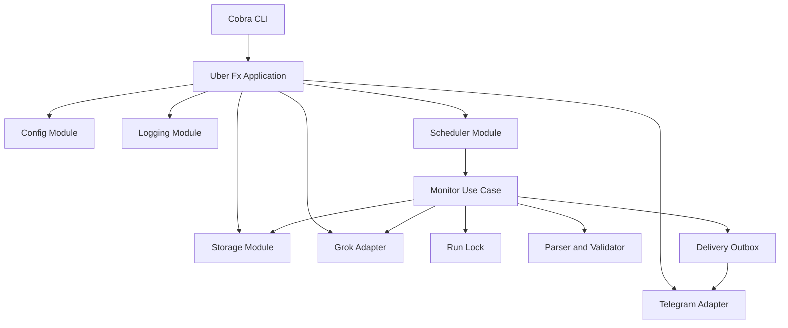
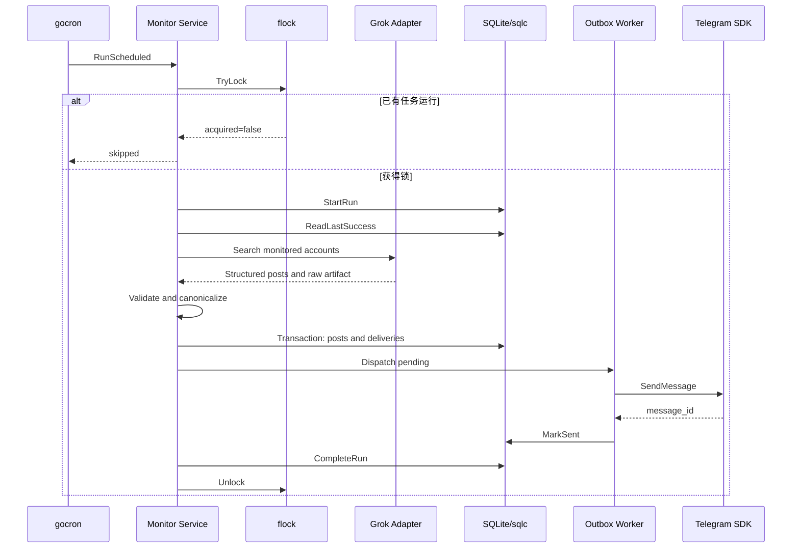

# x-monitor 系统架构设计

## 1. 目标与边界

`x-monitor` 是一个独立于 Codex 和 `codex-grok-search` Skill 的 Go 常驻服务。

系统负责：

- 每小时监控指定公开 X/Twitter 账户。
- 通过 Grok CLI 和 Grok X Search 检索内容。
- 覆盖原创、回复和转帖，不设置关键词过滤。
- 使用 X status URL 去重。
- 使用 SQLite 持久化运行状态、帖子和投递状态。
- 仅在存在新帖子时通过 Telegram Bot 推送。
- 在服务重启、任务失败和 Telegram 暂时不可用时恢复。

系统不负责：

- 控制 Codex 桌面任务。
- 使用浏览器登录或抓取 X。
- 直接读取浏览器 Cookie。
- 提供 X 官方 API 等级的完整性 SLA。
- 在本地运行大模型。

运行时不需要 Codex，但 Grok CLI 会访问 xAI 的 Grok 服务和 X Search。

## 2. 架构风格

采用“模块化单体 + Hexagonal Architecture + Uber Fx 生命周期管理”。



### 2.1 Domain

Domain 层只定义业务对象和业务规则：

- Account
- Post
- Run
- Delivery
- SearchWindow
- ContentType
- DeliveryState

Domain 层不知道 SQLite、Telegram、Grok、gocron 和文件系统的存在。

### 2.2 Application

Application 层实现用例编排：

- `RunMonitor`
- `DispatchPendingDeliveries`
- `RecoverInterruptedRuns`
- `GetServiceStatus`
- `RunDiagnostics`

Application 只依赖 ports 接口，不依赖具体第三方 SDK。

### 2.3 Ports

核心接口：

```go
type Searcher interface {
	Search(ctx context.Context, request SearchRequest) (SearchResult, error)
}

type PostRepository interface {
	InsertNewPosts(ctx context.Context, runID uuid.UUID, posts []Post) ([]Post, error)
}

type RunRepository interface {
	Start(ctx context.Context, run Run) error
	Complete(ctx context.Context, result RunResult) error
	LastSuccessful(ctx context.Context) (*Run, error)
}

type DeliveryRepository interface {
	CreatePending(ctx context.Context, posts []Post, destination string) error
	ClaimNext(ctx context.Context, owner string, lease time.Duration) (*Delivery, error)
	MarkSent(ctx context.Context, id int64, telegramMessageID int64) error
	MarkRetry(ctx context.Context, id int64, next time.Time, cause error) error
	MarkDead(ctx context.Context, id int64, cause error) error
}

type Notifier interface {
	Send(ctx context.Context, notification Notification) (Receipt, error)
}

type RunLocker interface {
	TryLock(ctx context.Context) (unlock func() error, acquired bool, err error)
}
```

### 2.4 Adapters

Adapters 实现 ports：

- Grok CLI Searcher
- SQLite repositories
- Telegram notifier
- 文件锁

第三方 SDK 只能出现在 adapter 或 infrastructure 层。

## 3. 运行流程



正常运行步骤：

1. gocron 在每个整点触发任务。
2. gocron singleton 检查同一进程内是否重叠。
3. flock 检查是否有另一个进程正在执行。
4. SQLite 创建本轮 run。
5. 计算查询窗口。
6. Grok Adapter 在隔离环境调用 Grok CLI。
7. 保存 prompt、stdout、stderr、manifest 和原始结果。
8. 解析并验证结构化帖子。
9. 规范化 status URL。
10. 在同一事务中插入新帖子和 pending delivery。
11. Outbox Worker 顺序推送 Telegram。
12. 推送成功后保存 Telegram message ID。
13. Grok 完整成功后推进成功游标。

## 4. 调度与恢复

### 4.1 正常调度

```text
Cron: 0 * * * *
Timezone: Asia/Shanghai
Overlap: skip
Job timeout: 50m
```

### 4.2 查询窗口

正常运行：

```text
查询最近2小时
只报告尚未发送的新 status URL
```

首次运行：

```text
查询最近2小时
只发送最近1小时内的帖子
较早结果只进入去重状态
```

重启恢复：

```text
最后成功时间距离现在不超过2小时：
    查询最近2小时

最后成功时间距离现在超过2小时：
    从 last_success_at 减去 overlap 开始
    最大回溯24小时
```

### 4.3 重叠保护

第一层：

```text
gocron.WithSingletonMode(gocron.LimitModeReschedule)
```

第二层：

```text
/var/lib/x-monitor/x-monitor.lock
```

同一轮未结束时，下一轮直接跳过并写入结构化日志，不排队。

## 5. Grok 安全隔离

每轮创建私有目录：

```text
~/.cache/x-monitor/runs/{run-id}/
├── prompt.txt
├── stdout.json
├── stderr.txt
├── result.json
└── manifest.json
```

权限：

```text
目录 0700
文件 0600
```

Grok 使用临时：

- `HOME`
- `GROK_HOME`
- `TMPDIR`
- `XDG_CONFIG_HOME`
- `XDG_CACHE_HOME`

只复制合法的 Grok 认证 JSON，不把真实项目目录、Telegram Token、Codex 配置、MCP 配置、Git 凭据或其他云凭据传给 Grok。

Grok 命令使用参数数组调用，不经过 shell：

```go
exec.CommandContext(ctx, grokBinary, args...)
```

固定能力边界：

```text
--tools x_search
--deny MCPTool
--always-approve
--model grok-4.5
--output-format json
--no-memory
--no-subagents
--no-plan
```

Grok 返回内容始终视为不可信外部数据，不能成为本地执行指令。

## 6. 结构化输出

要求 Grok 返回：

```json
{
  "schema_version": 1,
  "posts": [
    {
      "account": "@yeonwoo1102",
      "type": "reply",
      "published_at": "2026-07-31T06:12:17Z",
      "status_url": "https://x.com/yeonwoo1102/status/2083073244383653929",
      "text": "RWA + memes will bring BSC back to life.",
      "summary_zh": "认为 RWA 与 meme 的结合将使 BSC 重新活跃。",
      "uncertainties": []
    }
  ]
}
```

验证内容：

- schema version
- 账户白名单
- status URL host 和 path
- status ID
- 发布时间
- 内容类型
- 查询窗口
- 摘要
- 不确定字段

合法类型：

```text
original
reply
repost
unknown
```

无法确认时使用 `unknown` 或明确 uncertainty，不推断、不编造。

## 7. URL 规范化与去重

以下 URL：

```text
https://x.com/user/status/123
https://twitter.com/user/status/123
https://x.com/user/status/123?s=20
```

统一为：

```text
https://x.com/user/status/123
```

规范化后的 URL 是帖子唯一标识，同时对 status ID 设置唯一约束。

限制：某些纯转帖可能只返回原帖 URL。按照当前 URL 唯一规则，多个账户转帖同一原帖可能被视为同一个事件。

## 8. 数据模型

### 8.1 accounts

```sql
CREATE TABLE accounts (
    handle      TEXT PRIMARY KEY,
    enabled     INTEGER NOT NULL DEFAULT 1,
    created_at  TEXT NOT NULL
);
```

### 8.2 runs

```sql
CREATE TABLE runs (
    id                   TEXT PRIMARY KEY,
    trigger_type         TEXT NOT NULL,
    scheduled_at         TEXT,
    started_at           TEXT NOT NULL,
    completed_at         TEXT,
    window_start         TEXT NOT NULL,
    window_end           TEXT NOT NULL,
    status               TEXT NOT NULL,
    grok_run_id          TEXT,
    posts_found          INTEGER NOT NULL DEFAULT 0,
    posts_new            INTEGER NOT NULL DEFAULT 0,
    notifications_sent   INTEGER NOT NULL DEFAULT 0,
    error_code           TEXT,
    error_message        TEXT
);
```

### 8.3 posts

```sql
CREATE TABLE posts (
    status_url         TEXT PRIMARY KEY,
    status_id          TEXT NOT NULL UNIQUE,
    account_handle     TEXT NOT NULL,
    content_type       TEXT NOT NULL,
    published_at       TEXT,
    original_text      TEXT,
    summary_zh         TEXT NOT NULL,
    uncertainty        TEXT,
    first_seen_run_id  TEXT NOT NULL,
    first_seen_at      TEXT NOT NULL,
    raw_json           TEXT NOT NULL,
    FOREIGN KEY (account_handle) REFERENCES accounts(handle),
    FOREIGN KEY (first_seen_run_id) REFERENCES runs(id)
);
```

### 8.4 deliveries

```sql
CREATE TABLE deliveries (
    id                     INTEGER PRIMARY KEY AUTOINCREMENT,
    status_url             TEXT NOT NULL,
    destination            TEXT NOT NULL,
    state                  TEXT NOT NULL,
    attempts               INTEGER NOT NULL DEFAULT 0,
    next_attempt_at        TEXT,
    processing_owner       TEXT,
    processing_expires_at  TEXT,
    telegram_message_id    INTEGER,
    sent_at                TEXT,
    last_error             TEXT,
    created_at             TEXT NOT NULL,
    updated_at             TEXT NOT NULL,
    FOREIGN KEY (status_url) REFERENCES posts(status_url),
    UNIQUE (status_url, destination)
);
```

### 8.5 monitor_state

```sql
CREATE TABLE monitor_state (
    key         TEXT PRIMARY KEY,
    value       TEXT NOT NULL,
    updated_at  TEXT NOT NULL
);
```

SQLite 设置：

```sql
PRAGMA journal_mode = WAL;
PRAGMA foreign_keys = ON;
PRAGMA busy_timeout = 5000;
PRAGMA synchronous = NORMAL;
```

数据库必须放在本机文件系统，不放在 NFS。

## 9. Telegram Outbox

帖子和投递记录在同一事务创建：

```text
BEGIN
  insert post
  insert pending delivery
COMMIT
```

状态机：

```text
pending → processing → sent
                     ↘ retry → processing
                     ↘ dead
```

重试策略：

- 网络错误：指数退避。
- HTTP 429：优先采用 Telegram `RetryAfter`。
- HTTP 5xx：指数退避。
- HTTP 400/401/403：永久错误。
- 最大尝试次数：8。

Telegram 没有通用消息幂等键，因此在“消息已成功送达，但 sent 状态尚未提交时进程崩溃”的极窄窗口内可能重复发送一次。系统提供可靠的至少一次投递，不承诺不可实现的绝对恰好一次。

## 10. 部署

生产服务是常驻 Go 进程，定时完全由 gocron 完成。

推荐目录：

```text
/usr/local/bin/x-monitor
/etc/x-monitor/config.toml
/etc/x-monitor/secrets.env
/var/lib/x-monitor/state.db
/var/lib/x-monitor/runs/
/var/lib/x-monitor/x-monitor.lock
```

Linux 可以使用普通 systemd service 做开机启动和崩溃重启，但不使用 systemd timer。
